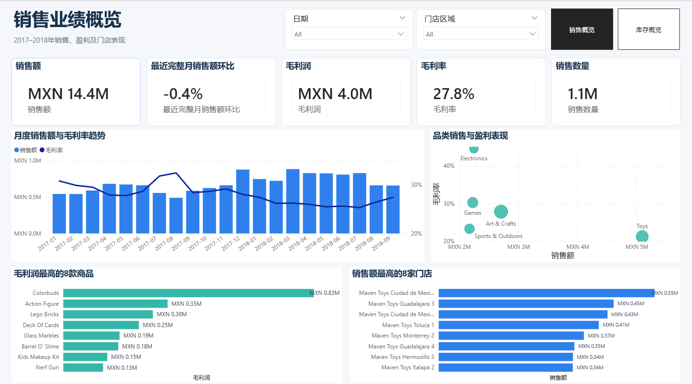
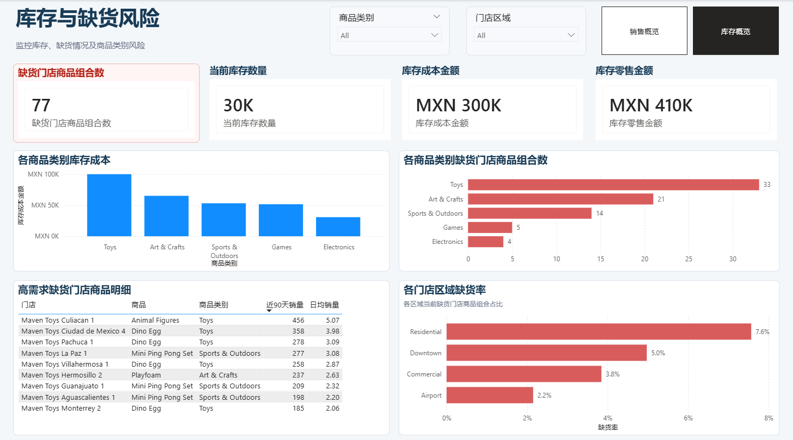

# Mexico 玩具销售与库存分析

## 1. 项目简介

本项目以 Python Notebook 和 Power BI 为主，整理销售、商品、门店和库存四类数据，分析销售规模、利润表现及单时点库存风险。项目没有使用 SQL。

## 2. 分析目标

- 汇总销售额、销售数量、毛利润和毛利率。
- 比较商品类别、商品和门店的销售与利润表现。
- 观察月度趋势及最近完整月销售额环比。
- 描述当前库存、库存价值、缺货组合和门店区域缺货率。

## 3. 数据来源与数据范围

项目使用 Mexico Toy Sales 公开练习数据：

| 数据 | 粒度 | 内容 |
|---|---|---|
| sales | 一条销售记录 | 日期、门店、商品和销售件数 |
| products | 一个商品 | 商品名称、类别、成本和售价 |
| stores | 一家门店 | 门店名称、城市、区域和开业日期 |
| inventory | 一个门店—商品组合 | 当前库存件数 |

销售数据范围为 **2017-01-01 至 2018-09-30**，共 829,262 条记录；商品 35 个、门店 50 家，库存表包含 1,593 个实际门店—商品组合。`data_sample/` 是少量样例，不等同于 `data/` 中用于完整处理的数据。

所有金额均以 **MXN（墨西哥比索）** 表示。

## 4. 使用工具

- Python / Pandas / Jupyter Notebook：清洗、多表关联、指标计算和 CSV 输出。
- Power BI：读取 `output/` 中处理后的 CSV，建立销售与库存模型并制作两页 Dashboard。
- 本项目没有 SQL 脚本或数据库依赖。

## 5. 数据处理过程

1. 转换销售日期和门店开业日期，清洗商品成本与价格字段。
2. 检查缺失值、重复行、商品和门店主键。
3. 将销售表与商品、门店维度表关联，并校验 `many_to_one` 粒度。
4. 计算销售额、销售成本、毛利润、库存成本和库存零售价值。
5. 以最大销售日期为终点汇总最近 90 天销量，估算日均销量和库存覆盖天数。
6. 将 `sales_fact.csv`、`products.csv`、`stores.csv` 和 `inventory_fact.csv` 输出到 `output/`，作为 Power BI 的实际数据源。

Notebook 使用相对路径：从 `data/` 读取原始 CSV，向 `output/` 写入处理结果。分析文件见 [mexico_toy_sales_analysis.ipynb](mexico_toy_sales_analysis.ipynb)。

## 6. 主要指标口径

| 指标 | 定义 |
|---|---|
| 销售额 | `Units × Product_Price` 的合计，币种 MXN |
| 毛利润 | 销售额 − `Units × Product_Cost`，未扣除其他运营费用 |
| 毛利率 | 毛利润 / 销售额，为加权整体毛利率 |
| 销售数量 | `Units` 合计 |
| 当前库存 | 库存快照中 `Stock_On_Hand` 合计 |
| 库存成本 | `Stock_On_Hand × Product_Cost` 的合计 |
| 库存零售价值 | `Stock_On_Hand × Product_Price` 的合计 |
| 缺货组合 | `Stock_On_Hand = 0` 的门店—商品组合数 |
| 缺货率 | 缺货组合 / 库存表实际存在的 1,593 个组合 |

最大销售日期为 2018-09-30，9 月是完整月份，因此最近完整月为 **2018-09**，与 **2018-08** 比较。9 月销售额为 MXN 658,194.48，8 月为 MXN 660,877.07，环比约 **-0.4%**；前月为空或为 0 时指标返回空值。

## 7. 分析内容

- 销售额、销售数量、毛利润、毛利率和最近完整月环比。
- 月度销售额与毛利率趋势、类别销售与利润表现。
- 毛利润最高的商品和销售额最高的门店。
- 当前库存、库存成本、库存零售价值及缺货组合。
- 商品类别、门店区域的缺货分布和高需求缺货明细。

## 8. 主要发现

- 总销售额约 MXN 14.4M，毛利润约 MXN 4.0M，整体毛利率为 27.8%，销售数量约 1.1M 件。
- Toys 的销售规模最高；Electronics 的毛利率较高，销售规模与利润率需要分开观察。
- Colorbuds 的累计毛利润最高。
- 当前库存约 30K 件，库存成本约 MXN 300K，库存零售价值约 MXN 410K。
- 1,593 个实际库存组合中有 77 个缺货，整体缺货率约 4.8%；Residential 区域缺货率较高。

## 9. Dashboard 展示





## 10. 项目文件结构

```text
03_Mexico_Toy_Sales/
├─ README.md
├─ mexico_toy_sales_analysis.ipynb
├─ data/          # Notebook 读取的原始数据
├─ data_sample/   # 少量展示样例
├─ docs/          # 数据字典等说明
├─ images/        # 两张最终 Dashboard 截图
├─ output/        # Notebook 输出及 Power BI 实际数据源
└─ powerbi/       # PBIP 项目文件
```

## 11. 如何查看或复现

直接查看上方截图即可浏览最终结果。完整复现时，将四张原始 CSV 放入 `data/`，在项目根目录打开并运行 [Notebook](mexico_toy_sales_analysis.ipynb)，确认结果写入 `output/`，再打开 [Power BI 项目](powerbi/mexico_toy_sales_inventory.pbip)。其他设备需要将 Power BI 的 CSV 数据源重新指向本机 `output/`。

## 12. 数据限制

- 库存数据是没有快照日期的单时点状态，不能分析补货历史或库存趋势。
- 缺货率分母是实际记录的 1,593 个组合；缺少的 157 个理论组合无法判断是未经营还是未记录。
- 最近 90 天日均销量和库存覆盖天数是静态估算，不是预测模型。
- 数据没有采购、交货周期、安全库存和运营费用，不能直接形成完整补货或净利润结论。
- 商品、门店和类别差异均为描述性结果，不能据此判断因果关系。
